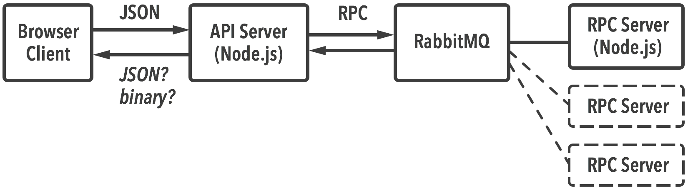

# Stateless AJAX RPC Example

*An example project.*

The main purpose of this example is to show how a “mixed” AJAX response with unknown content type can be handled by a browser client using jQuery. Also demonstrates how to use RabbitMQ for RPC from Node.js (via [`amqplib`](https://github.com/squaremo/amqp.node)).

- A [**Node.js web server**](https://github.com/j13z/stateless-ajax-rpc-example/blob/master/src/server.js?ts=4) serves API requests. Contacts an [**RCP server / worker**](https://github.com/j13z/stateless-ajax-rpc-example/blob/master/src/rpc-server.js?ts=4) via **RabbitMQ** (AMQP), which generates files that should be served to the client (e.g. create a PDF or process an image or audio).

- The [**browser client**](https://github.com/j13z/stateless-ajax-rpc-example/blob/master/static/client.html?ts=4) makes requests using a custom jQuery AJAX transport. It does not know the content type of the response in advance: It’s either binary data on success, or JSON if there is an error. jQuery can’t handle binary (`Blob`) responses out of the box. (jQuery’s AJAX implementation is used as it provides good browser compatibility.)

- The server system **does not keep any state**. After processing the request, it sends a response and forgets about the request. Instead of responding with file links, it **sends binary data directly to the browser client** (or JSON in case of an error).

- Processing can be scaled to accommodate higher load by using multiple RPC server instances. (File processing is mocked here.)

## Motivation

Generally there are several ways to serve a “transient” file from an API, e.g.:

1. **Base64-encode it** and embed it into a JSON response as a string.
  
  *Drawback:* File size overhead (plus some encoding / decoding). 
  
  *Benefit*: Easy to serve multiple files (e.g. multiple formats) per response.

2. **Link to a static file** URL in the JSON response.

  *Drawback:* Stateful, requires file management / expiration.
  
  *Benefit:* If stateful anyway, processing can be “reified” as an item in a queue and [exposed as an endpoint](http://restcookbook.com/Resources/asynchroneous-operations/) (which could be RESTful). Progress information can then be provided via this endpoint (client polling).

3. **Send the binary file directly** to the client (binary response on an API URL, not a URL that links to a temporary file), or JSON on error.

  *Benefit:* Lightweight.

  *Drawback:* Client needs to handle this rather odd response format, as demonstrated here.

4. Do something more exotic like pushing files via **WebSockets** (Socket.IO supports binary since 1.0).

This example demonstrates approach **3**. (That’s not to say that this approach is the best; the Base64 approach might be better suited for most use cases.)

### Example use case

Generate PDFs on a server, but *without keeping state* in form of client PDF files (that have yet to be retrieved) on the server. Instead, send each client the PDF and forget about it, i.e. delete the file. This frees the server from keeping track of file lifetimes etc. (*Drawback:* Does not provide progress information; which is however not a drawback if no meaningful progress information can be generated anyway.)

## Run it

Dependencies: RabbitMQ, Node.js

- `$ npm install`
- Build the project (compile ES6): `$ ./node_modules/.bin/gulp` (or just `gulp`)
- Start RabbitMQ server (tmux recommended): `[shell1] $ rabbitmq-server`
- Start web server: `[shell2] $ ./dist/server.js`
- Start RPC server: `[shell3] $ ./dist/rpc-server.js` (add more instances as needed)
- Open the browser client: [http://127.0.0.1:8000/client.html](http://127.0.0.1:8000/client.html)

## Notes

- Would use HTTPS in production.

- See [RabbitMQ’s RPC example](http://www.rabbitmq.com/tutorials/tutorial-six-python.html).
